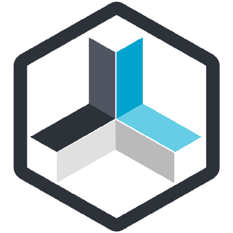

# ioBroker.repetier-server

**Tests:** 

## Repetier-Server adapter for ioBroker

Adapter to communicate with your Repetier Server! Supported features:

- Connection by websocket which ensures real-time updates of values (where supported by Repetier-Server, like bed/extruder temperatures)
- All other values are updated every 5 seconds
- Capability to send custom g-code commands by ioBroker state or predefined g-code commands defined in admin instance (not yet implemented)

### Getting started

You are almost done, only a few steps left:
1. Install adapter by npm (preferred) or git, (request to add to ioBroker repository in progress)
2. Add an instance
3. Provide you IP-ares, port and your API-Token (token only needed if authorisation is activated on Repetier Server). 
4. Adapter will start and create states with all values provided by Webscocket-API
5. If no states are created, please check your log if any error occurs

## Changelog
<!--
	Placeholder for the next version (at the beginning of the line):
	### **WORK IN PROGRESS**
-->
### 0.1.0 (2023-02-07) - Repetier-Server Adapter First Beta release for Public testing
* (DutchmanNL) initial release

## License
MIT License

Copyright (c) 2023 DutchmanNL <oss@DrozmotiX.eu>

Permission is hereby granted, free of charge, to any person obtaining a copy
of this software and associated documentation files (the "Software"), to deal
in the Software without restriction, including without limitation the rights
to use, copy, modify, merge, publish, distribute, sublicense, and/or sell
copies of the Software, and to permit persons to whom the Software is
furnished to do so, subject to the following conditions:

The above copyright notice and this permission notice shall be included in all
copies or substantial portions of the Software.

THE SOFTWARE IS PROVIDED "AS IS", WITHOUT WARRANTY OF ANY KIND, EXPRESS OR
IMPLIED, INCLUDING BUT NOT LIMITED TO THE WARRANTIES OF MERCHANTABILITY,
FITNESS FOR A PARTICULAR PURPOSE AND NONINFRINGEMENT. IN NO EVENT SHALL THE
AUTHORS OR COPYRIGHT HOLDERS BE LIABLE FOR ANY CLAIM, DAMAGES OR OTHER
LIABILITY, WHETHER IN AN ACTION OF CONTRACT, TORT OR OTHERWISE, ARISING FROM,
OUT OF OR IN CONNECTION WITH THE SOFTWARE OR THE USE OR OTHER DEALINGS IN THE
SOFTWARE.